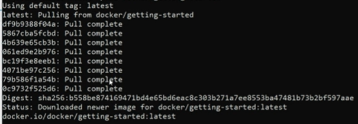

### Commands for docker- also check while running given in doc and docker app also

1. 
- docker
- docker -v
- **For checking installation, run it in command prompt.**

2. [Docker Hub](https://hub.docker.com/)
- It is a community place where we can find public repos and containers,images etc. Even login is not required.We can run these on our machine very easily.

3. Pull an image(Or use gui tool in docker desktop)
- docker pull docker/getting-started
- **Run it inside C:Users/username in cmd**
- output will be like:
- 
- Tags are different version of images
- The hashes we see on left corner are different layers in the images like github commits

4. see images
- docker images

5. Run an image or convert the image to container(or gui tool)
- docker run -d -p 80:80 docker/getting-started
- if image is not present then it will automatically run pull command
- These can be found in dockerhub also
- The containers can be paused in dockerhub , restarted--These are the real workspace where we make changes to the image
- **d means detached mode and - p contains host:signing port then is for name of image**
- **Host and signing port are the accessports from 127.0.0.1(our machine) and the docker container**
- **We can use mappings of one port to other, But if we will try out a:b and a:c or use the same port mapped to multiple ports, container will be created but it will not run as the port is busy.**
- **Check localhost:port for chcking running instance**
- **For same image the container port as well as host port needs to be different for each instance. For different image same container port can be there between images but different host port**

6. To check running containers
- docker ps 

7. To stop the container(Not delete)
- docker stop containerid

8. To restart again(but this will form a container with new id)
- docker run -d -p portmapping docker/getting-started

9. To remove image
- docker image rm imageid
- docker image rm -f imageid

10. To pull a specific version
docker pull imagename:tag